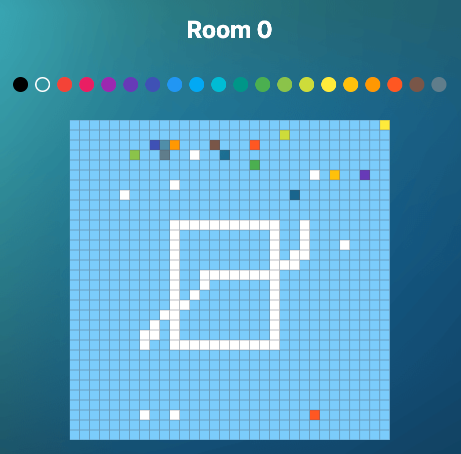

<!-- Improved compatibility of back to top link: See: https://github.com/othneildrew/Best-README-Template/pull/73 -->

[![Contributors][contributors-shield]][contributors-url]
[![Forks][forks-shield]][forks-url]
[![Stargazers][stars-shield]][stars-url]
[![Issues][issues-shield]][issues-url]
[![MIT License][license-shield]][license-url]

<!-- PROJECT LOGO -->
 

  

<h3 align="center">Sui Place</h3>

  

    This is a basic pixel war game writtin in Move. Users can color the pixel after connecting their wallet to the game. The game is built on the SUI network.
     
     
    <a href="https://github.com/Volthai7us/sui-place">View Demo</a>
    ·
    <a href="https://github.com/Volthai7us/sui-place/issues">Report Bug</a>
    ·
    <a href="https://github.com/Volthai7us/sui-place/issues">Request Feature</a>
  

## About The Project

[contributors-shield]: https://img.shields.io/github/contributors/Volthai7us/sui-place.svg?style=for-the-badge
[contributors-url]: https://github.com/Volthai7us/sui-place/graphs/contributors
[forks-shield]: https://img.shields.io/github/forks/Volthai7us/sui-place.svg?style=for-the-badge
[forks-url]: https://github.com/Volthai7us/sui-place/network/members
[stars-shield]: https://img.shields.io/github/stars/Volthai7us/sui-place.svg?style=for-the-badge
[stars-url]: https://github.com/Volthai7us/sui-place/stargazers
[issues-shield]: https://img.shields.io/github/issues/Volthai7us/sui-place.svg?style=for-the-badge
[issues-url]: https://github.com/Volthai7us/sui-place/issues
[license-shield]: https://img.shields.io/github/license/Volthai7us/sui-place.svg?style=for-the-badge
[license-url]: https://github.com/Volthai7us/sui-place/blob/master/LICENSE.txt
[product-screenshot]: images/sui-place.png
[react.js]: https://img.shields.io/badge/React-20232A?style=for-the-badge&logo=react&logoColor=61DAFB
[react-url]: https://reactjs.org/
